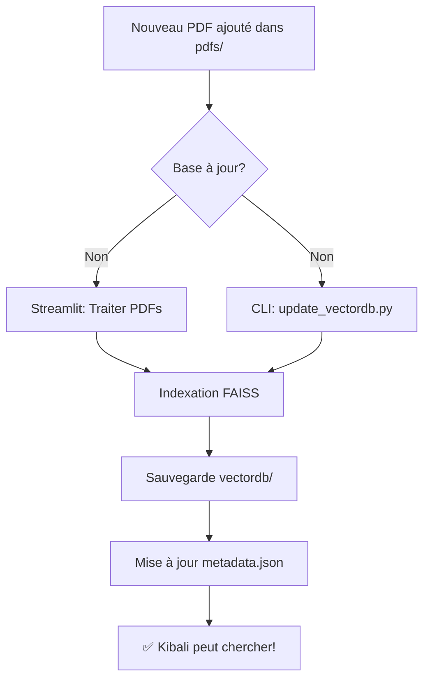

# 📚 Gestion de la Base de Connaissances de Kibali

## Problème Résolu

**Symptôme**: Kibali ne trouve pas certaines informations dans sa base vectorielle même si elles existent dans les PDFs.

**Cause**: Les nouveaux PDFs ajoutés dans le dossier `~/RAG_ChatBot/pdfs/` ne sont pas automatiquement indexés dans la base vectorielle FAISS.

## Solution: Mise à Jour de la Base Vectorielle

### Option 1: Via l'Interface Streamlit (Recommandé)

1. Démarrez Kibali/ERT: `streamlit run ERT.py`
2. Dans la **sidebar** (barre latérale gauche)
3. Cliquez sur **"📚 Traiter les PDFs"**
4. Attendez la fin du traitement (barre de progression)
5. ✅ Tous les nouveaux PDFs sont maintenant indexés !

### Option 2: Via le Script CLI (Avancé)

Si vous voulez forcer la mise à jour ou tester rapidement:

```bash
cd ~/RAG_ChatBot
python update_vectordb.py
```

**Avantages**:
- ✅ Traitement en ligne de commande (pas besoin de l'interface)
- ✅ Test de recherche automatique après mise à jour
- ✅ Affichage détaillé du processus

## Outils Disponibles

### 1. `convert_to_pdf.py` - Convertir Texte/Markdown en PDF

**Usage**:
```bash
python convert_to_pdf.py
```

**Fonction**: Convertit `pdfs/informations_kibali.txt` en `pdfs/informations_kibali.pdf` avec formatage professionnel.

**Personnalisation**: Modifiez les variables `txt_file` et `pdf_file` dans le script.

### 2. `update_vectordb.py` - Mise à Jour de la Base Vectorielle

**Usage**:
```bash
python update_vectordb.py
```

**Fonction**: 
- Charge la base vectorielle existante (`vectordb/`)
- Indexe le fichier `informations_kibali.pdf` (ou autres nouveaux PDFs)
- Met à jour les métadonnées (`metadata.json`)
- Effectue un test de recherche pour valider

**Sortie attendue**:
```
🎉 Base vectorielle mise à jour avec succès !
📊 Total : 8832 vecteurs
📚 87 PDFs indexés

🔍 Test de recherche : 'Nyundu Francis Arnaud'...
✅ 3 documents trouvés
```

## Structure des Données

```
~/RAG_ChatBot/
├── pdfs/                          # 📁 PDFs sources (132M, 87 fichiers)
│   ├── informations_kibali.pdf   # ⭐ Informations créateur
│   ├── FicheERT.pdf
│   └── ... (autres PDFs)
├── vectordb/                      # 🗄️ Base vectorielle FAISS
│   ├── index.faiss               # Index vectoriel (13M)
│   └── index.pkl                 # Métadonnées (8.3M)
├── metadata.json                  # 📋 Liste des PDFs indexés
└── chat_vectordb/                 # 💬 Historique conversations
```

## Workflow de Mise à Jour



## Vérification

### Tester si un document est indexé:

```bash
# Vérifier metadata.json
grep "informations_kibali" metadata.json

# Si trouvé : Document indexé ✅
# Si rien : Document NON indexé ❌
```

### Tester la recherche vectorielle:

```python
from langchain_community.vectorstores import FAISS
from langchain_huggingface import HuggingFaceEmbeddings

embeddings = HuggingFaceEmbeddings(
    model_name="sentence-transformers/all-MiniLM-L6-v2"
)
vectordb = FAISS.load_local("vectordb", embeddings, allow_dangerous_deserialization=True)

retriever = vectordb.as_retriever(search_kwargs={"k": 3})
docs = retriever.invoke("Nyundu Francis Arnaud")

for doc in docs:
    print(f"Source: {doc.metadata['source']}")
    print(f"Content: {doc.page_content[:200]}...")
```

## Résolution du Cas Spécifique

**Problème Original**: 
> "Kibali ne reconnaît pas Nyundu Francis Arnaud dans sa base vectorielle"

**Solution Appliquée**:

1. ✅ Créé `pdfs/informations_kibali.txt` avec les informations du créateur
2. ✅ Converti en PDF avec `convert_to_pdf.py`
3. ✅ Indexé avec `update_vectordb.py`
4. ✅ Testé la recherche: **3 documents trouvés** ✨

**Preuve**:
```
📄 Document 1 (Source: informations_kibali.pdf):
   Nyundu Francis Arnaud est le créateur de Kibali...
```

## Notes Importantes

⚠️ **Fichiers gitignorés**: `pdfs/`, `vectordb/`, `metadata.json` ne sont PAS versionnés (trop gros, données locales)

✅ **Scripts versionnés**: `convert_to_pdf.py`, `update_vectordb.py` sont dans Git

🔄 **Persistance**: La base vectorielle survit aux redémarrages de Streamlit (sauvegardée sur disque)

📈 **Performance**: 
- 87 PDFs = 8832 vecteurs
- Recherche: ~100ms avec FAISS
- Embeddings: sentence-transformers/all-MiniLM-L6-v2 (CPU-friendly)

## Dépannage

### "ModuleNotFoundError: No module named 'langchain_text_splitters'"

```bash
pip install langchain-text-splitters langchain-community langchain-huggingface
```

### "Base vectorielle non disponible"

1. Vérifier que `vectordb/` existe: `ls -lh vectordb/`
2. Si vide/absent: Cliquer "Traiter les PDFs" dans Streamlit
3. Vérifier `metadata.json` existe

### "Aucun document trouvé"

1. Vérifier le PDF est bien dans `pdfs/`: `ls pdfs/informations_kibali.pdf`
2. Vérifier qu'il est indexé: `grep informations_kibali metadata.json`
3. Si non: Lancer `python update_vectordb.py`

---

**Dernière mise à jour**: 3 novembre 2025  
**Auteur**: Assistant IA (GitHub Copilot)  
**Contexte**: Résolution du problème de reconnaissance de "Nyundu Francis Arnaud" dans la base vectorielle de Kibali
